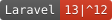
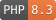

# Directory Link






Resources for connecting to the Directory system

## Installation

1. Install using Composer:
   ```bash
   composer require networkrailbusinesssystems/directory-link
   ```
2. Publish and adjust the `directory-link.php` config file:
   ```bash
   php artisan vendor:publish --tag="entra"
   ```
3. Adjust your `.env` to include the required settings
4. Ensure you have the needed database columns for syncing, if used

## Configuration

The following settings can be changed in your `.env`:

| .env key           | Config key                  | Required | Notes                                      |
|--------------------|-----------------------------|----------|--------------------------------------------|
| DIRECTORY_ENDPOINT | directory-link.api.endpoint | Yes      | The URL of the Directory system            |
| DIRECTORY_TOKEN    | directory-link.api.token    | Yes      | The Directory access token for this system |


The following additional settings are available in the `directory-link.php` configuration file:

| Config key              | Required | Default                           | Notes                                                               |
|-------------------------|----------|-----------------------------------|---------------------------------------------------------------------|
| models                  | Yes      | array                             | The types of models available                                       |
| models.<type>           | Yes      | array                             | How the model maps from the directory to locally                    |
| models.<type>.directory | Yes      | DirectoryGroup, DirectoryUser     | The FQN of the directory model                                      |
| models.<type>.local     | No       | App\Models\Group, App\Models\User | The FQN of the local model                                          |
| sync                    | No       | array                             | The types of models which can be synced                             |
| sync.<type>             | No       | array                             | How the model syncs from the directory to locally                   |
| sync.<type>.on          | No       | azure_id                          | Which field is used to match the directory model to the local model |
| sync.<type>.attributes  | No       | array                             | The fields to set on the local model from the directory model       |

## Usage

### Models

#### SyncsWithDirectory

Implement the `SyncsWithDirectory` interface on any local model which should store data from the directory.

The `UsesDirectory` trait is available with a default implementation.

| Method                     | Parameters            | Returns                   | Notes                                                                          |
|----------------------------|-----------------------|---------------------------|--------------------------------------------------------------------------------|
| importFromDirectory        | string $term          | Model<SyncsWithDirectory> | Attempt to create or update a local model from the directory                   |
| processDirectoryDetails    | DirectoryModel $model | Model<SyncsWithDirectory> | Perform any needed data transformation before it is applied to the local model |
| updateWithDirectoryDetails | DirectoryModel $model | Model<SyncsWithDirectory> | Apply the details from the directory model to the local model                  |

You can then call `MyModel::importFromDirectory($term)` to have them synced.

If the term cannot be found in the directory, it will throw a `NotInDirectoryException`.

#### DirectoryModel

Models are provided for all supported directory models:

* DirectoryGroup
* DirectoryUser

You can call the following methods from any directory model:

| Method | Parameters                                                                    | Returns               | Notes                                                                         |
|--------|-------------------------------------------------------------------------------|-----------------------|-------------------------------------------------------------------------------|
| exists | string $term, string $field                                                   | bool                  | Whether the given term exists in the directory                                |
| get    | string $term, string $field                                                   | DirectoryModel, false | Get a single specific entry from the directory, or false if it does not exist |
| list   | string $term, string $field, int $page, int $per, string $sort, string $order | LengthAwarePaginator  | Search for any matching entries in the directory                              |

### Rules

#### ExistsInDirectory

This rule checks whether the given input exists in the directory for the given model type and field.

```php
public function rules(): array
{
    return [
        'email' => [
            'required',
            'string',
            'email',
            new ExistsInDirectory(DirectoryUser::class, 'email'),        
        ];       
    ];   
}
```

### Commands

#### ImportUserFromDirectory

You can import models from the directory using the `directory-link:import {type} {term}` command:

```bash
php artisan directory-link:import user joe.bloggs@networkrail.co.uk
```

#### RefreshUsersFromDirectory

You can refresh all local models with updates from the directory using the `directory-link:refresh {type} {field}` command:

This is useful for backfilling information when local models have not been added using the directory.

```bash
php artisan directory-link:refresh user email
```

If left blank, the `field` parameter will use the `directory-link.<type>.on` setting.

This will only update existing local models.

It will not create or delete models.
